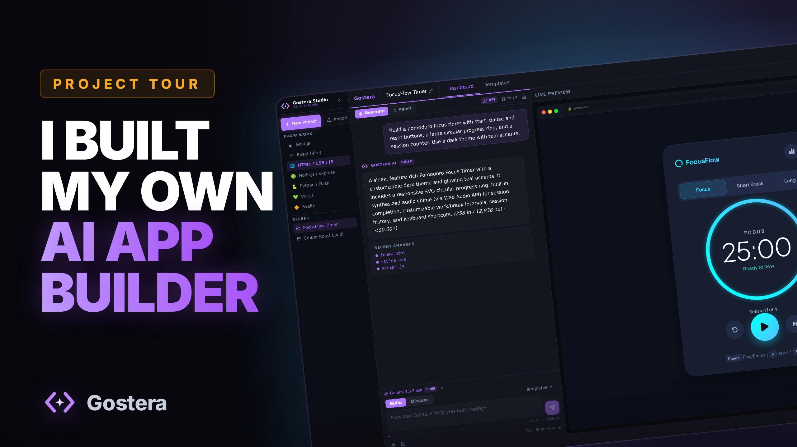
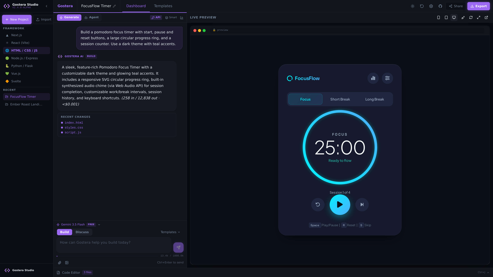
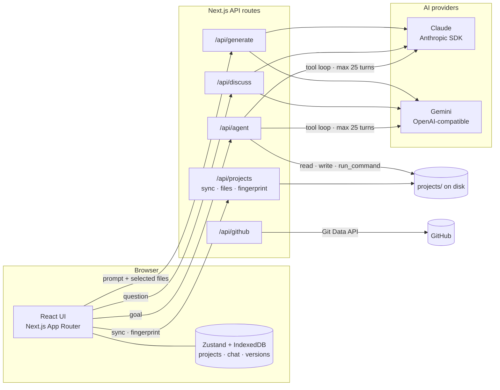

# Gostera

**An AI app builder with a real agent behind it.** Describe an app in plain
English and get working code back. Then hand the same project to an agent that
reads and writes real files on disk, installs packages, runs the build, reads its
own errors and fixes them without you in the loop.

Self-hosted, single-user, Next.js 14. Runs on Claude or Google Gemini, and the
free Gemini tier means a build can cost nothing.

---

## What it is

Most AI app builders talk to you through a chat window and hand back code as
text. The model never finds out whether what it wrote actually runs, so anything
past a single page falls apart and you end up debugging the AI's work by hand.

Gostera closes that loop. It has three modes that share one project:

- **Generate** — one-shot. Prompt in, whole project out, merged into your files.
  For an existing project it returns only what changed rather than rewriting
  everything.
- **Agent** — a tool loop. The model gets seven real tools and up to 25 turns. It
  writes files, runs `npm install` and `npm run build`, reads the failures and
  fixes them, streaming every step to the UI as it happens.
- **Discuss** — read-only Q&A over the real codebase. No file changes.

Seven target frameworks, five models across two providers, live preview, version
history with diffs, ZIP import/export, and push-to-GitHub.

---

## Demo video

<a href="https://ememndon.com/videos/gostera.mp4">
  
</a>

<video src="https://ememndon.com/videos/gostera.mp4" poster=".github/assets/video-poster.png" controls width="100%"></video>

---

## Screenshots

**Build mode — prompt on the left, live preview on the right**



**Agent mode — the tool loop running, streamed step by step**


**Code editor — file tree, syntax highlighting, in-file search**


**Usage dashboard — token spend, cost per model, live rate-limit buckets**


---

## Feature surface

**Agentic build loop**
- Seven tools: `get_project_manifest`, `read_file`, `write_file`, `delete_file`,
  `list_directory`, `search_files`, `run_command`
- Up to 25 autonomous turns; installs dependencies, builds, and self-corrects
- Every step streamed as newline-delimited JSON events (`turn_start`,
  `tool_call`, `tool_result`, `text`, `done`, `error`)
- **Plan-first mode** — the model writes a numbered plan and waits for approval
  before anything touches disk
- **Pre-run snapshot** — project state is saved to version history before every
  run, so any run is reversible
- Live token and cost meter while the loop runs; hard output-token ceiling per run
- Stop actually stops: the abort signal is threaded into the server-side loop

**Sandboxed command execution**
- Commands spawn **without a shell** — argv is parsed directly
- Shell metacharacters rejected outright: <code>&</code> <code>|</code> <code>;</code> <code>&lt;</code> <code>&gt;</code> <code>`</code> <code>$</code> <code>^</code> <code>%</code>
- Executable allowlist: `npm`, `npx`, `node`, `pip`, `git`, `tsc`, `vite`, `next`
- `git` restricted to local subcommands — `push`, `pull`, `fetch`, `clone` and
  `remote` are blocked
- Inline-eval flags (`node -e`, `python -c`) blocked
- Paths confined both lexically and after realpath resolution, so an in-project
  symlink cannot escape the project root
- 90-second timeout with full process-tree kill

**Multi-provider AI**
- Claude Haiku 4.5, Sonnet 4, Sonnet 4.6, Opus 4.8, and Gemini 3.5 Flash
- Gemini runs through its OpenAI-compatible endpoint with a hand-rolled adapter
  and no extra SDK — the same shape works for Groq or OpenRouter
- Routes branch on the provider *before* resolving credentials, so you only need
  a key for the provider you actually use
- Claude supports both subscription (OAuth) and metered API-key auth
- Prompt caching on the generate and agent paths

**Context handling**
- Files scored for relevance and packed to a token budget before every request
- Per-model context limits, with a Full Context override
- Truncated responses are salvaged: the parser walks the partial JSON and
  recovers every file object that completed, so a run that hits the output cap
  still returns most of the work

**Projects and safety net**
- Version history with line-by-line diffs and one-click restore
- Disk fingerprinting detects when the browser copy and the on-disk copy diverge,
  and surfaces a Sync prompt instead of silently overwriting
- Single-tab enforcement via the Web Locks API, so two tabs cannot corrupt shared
  state
- Import from folder, ZIP, or drag-and-drop, with framework auto-detection
- Export to ZIP; push to GitHub over the Git Data API

**Live preview**
- Inline iframe preview for HTML/CSS/JS with CSS and JS auto-inlined
- CDN-based preview for React + Vite
- Connect-to-local-server for everything else
- Mobile / tablet / desktop viewports; sandboxed iframe with no same-origin access

**Cost transparency**
- Per-model pricing with cache reads priced separately
- Usage dashboard: totals, per-framework breakdown, recent generation log
- Live rate-limit buckets read from provider response headers

---

## Architecture



The defining constraint: **the browser store and the disk are two copies of the
same project.** Generate mode owns the store and syncs down to disk; Agent mode
owns the disk and syncs back up. A fingerprint comparison sits between them and
raises a Sync prompt when they disagree, which is what keeps an agent run from
being silently reverted by the next Generate.

---

## Tech stack

| Layer | Choice |
|---|---|
| Framework | Next.js 14 (App Router), TypeScript |
| UI | React 18, Tailwind CSS v3, shadcn/ui on Radix primitives |
| State | Zustand with `persist` middleware |
| Storage | IndexedDB via `idb-keyval`; localStorage for UI prefs |
| AI — Claude | `@anthropic-ai/sdk`, streaming, OAuth or API key |
| AI — Gemini | Hand-rolled `fetch` adapter over the OpenAI-compatible endpoint |
| Agent runtime | Node `child_process.spawn`, no shell, allowlisted argv |
| Markdown | `react-markdown` + `remark-gfm` |
| Syntax highlighting | `highlight.js` |
| Archives | JSZip |
| GitHub | OAuth 2.0 + Git Data API, no SDK |
| Persistence backend | None — no database, no server-side project storage |

Roughly 10,600 lines of TypeScript across 15 API routes.

---

## Project structure

```
gostera/
├── app/
│   ├── layout.tsx
│   ├── page.tsx
│   ├── globals.css
│   └── api/
│       ├── generate/route.ts        # one-shot generation, streamed
│       ├── discuss/route.ts         # read-only Q&A over the project
│       ├── agent/route.ts           # the tool loop (both providers)
│       ├── status/route.ts          # which credential mode is active
│       ├── projects/
│       │   ├── sync/route.ts        # store → disk
│       │   ├── files/route.ts       # disk → store
│       │   ├── fingerprint/route.ts # drift detection
│       │   ├── folder/route.ts      # create / rename / delete
│       │   └── install/route.ts     # dependency install
│       └── github/                  # auth · callback · user · repos · push · disconnect
├── components/
│   ├── agent-panel.tsx              # agent run UI, plan approval, event stream
│   ├── chat-panel.tsx               # generate / discuss, model picker
│   ├── code-panel.tsx               # file tree, editor, in-file search
│   ├── preview-panel.tsx            # iframe preview, device sizes
│   ├── version-history-modal.tsx    # snapshots + line-by-line diff
│   ├── import-modal.tsx             # folder / ZIP / drag-and-drop import
│   ├── github-modal.tsx             # OAuth + push flow
│   ├── usage-modal.tsx              # cost and rate-limit dashboard
│   ├── single-tab-guard.tsx         # Web Locks single-tab enforcement
│   └── ui/                          # shadcn primitives
├── lib/
│   ├── agent-tools.ts               # the 7 tools + the command sandbox
│   ├── anthropic-client.ts          # subscription vs API-key resolution
│   ├── gemini-client.ts             # OpenAI-compatible provider adapter
│   ├── framework-prompts.ts         # per-framework system prompts
│   ├── file-selector.ts             # relevance scoring + token budgeting
│   ├── parse-response.ts            # response parsing + truncation salvage
│   ├── project-paths.ts             # filesystem boundary + fingerprinting
│   ├── token-estimate.ts            # per-model pricing
│   └── rate-limits.ts               # provider rate-limit header parsing
├── stores/
│   ├── project-store.ts             # projects, files, chat, versions, logs
│   └── ui-store.ts                  # UI state, model selection
├── hooks/
└── docs/
    └── ARCHITECTURE-AUDIT.md        # full self-audit + resolution of all findings
```

---

## Where to start reading

If you are reviewing this repo, these four files carry most of the interesting
engineering:

| File | Why |
|---|---|
| [`lib/agent-tools.ts`](lib/agent-tools.ts) | The seven tools and the command sandbox — argv parsing, allowlisting, path confinement, process-tree kill |
| [`app/api/agent/route.ts`](app/api/agent/route.ts) | The agent loop itself, with parallel Claude and Gemini implementations and a shared event stream |
| [`lib/parse-response.ts`](lib/parse-response.ts) | Truncation salvage — recovering complete files out of a half-finished JSON response |
| [`docs/ARCHITECTURE-AUDIT.md`](docs/ARCHITECTURE-AUDIT.md) | A full self-audit of this codebase, 16 findings, and what each fix became |

---

## Running it

### Requirements

Node.js 18.17+ (20 LTS or newer recommended) and npm.

### Setup

```bash
git clone https://github.com/ememndon/gostera.git
cd gostera
npm install
cp .env.example .env.local     # then add at least one AI key
```

You need **at least one** provider key:

| Variable | What it enables |
|---|---|
| `GEMINI_API_KEY` | Gemini 3.5 Flash — free tier, works in all three modes. Get one at [aistudio.google.com](https://aistudio.google.com) |
| `CLAUDE_CODE_OAUTH_TOKEN` | Claude via a Pro/Max subscription (`claude setup-token`) |
| `ANTHROPIC_API_KEY` | Claude via metered API billing |
| `GITHUB_CLIENT_ID` / `GITHUB_CLIENT_SECRET` | Optional — the "Push to GitHub" button |

### Run

```bash
npm run dev        # http://localhost:3000
```

Production:

```bash
npm run build
npm start          # PORT=8080 npm start to change port
```

> Don't run `npm run build` while `npm run dev` is running. They share the
> `.next` directory and will corrupt each other. Stop one first.

### Where your data lives

- **Generated projects:** a `projects/` directory created as a **sibling of this
  repo**. Agent mode is confined to that tree.
- **Projects, chat and versions:** IndexedDB, per browser profile. Nothing is
  stored server-side, so a fresh browser starts empty. Gostera is single-user by
  design and enforces a single open tab.

---

## ⚠️ Before you put this on a server

**Gostera has no authentication, and Agent mode executes commands on the machine
it runs on.**

Anyone who can reach the port can use Agent mode to read, write and delete files
in the projects directory and run `npm`/`node`/`python`/`git` commands **as the
user running the app**. The sandbox constrains *what* the agent can run, not
*where* it runs — `npm install` on a project is still real code execution.

This is a deliberate trade for a tool you run on your own machine. If you want it
on a server, pick at least one of these first:

1. **Don't expose it.** Bind to localhost and reach it over an SSH tunnel:
   ```bash
   # on the server
   HOSTNAME=127.0.0.1 npm start
   # from your laptop
   ssh -L 3000:127.0.0.1:3000 user@your-server
   ```
2. **Put an authenticating reverse proxy in front** — Caddy `basicauth`, nginx
   `auth_basic`, Cloudflare Access, Tailscale. Bind the app to `127.0.0.1` so
   only the proxy can reach it.
3. **Restrict by firewall** to your own IP.

Either way, run it as a **dedicated unprivileged user**, never root.

<details>
<summary>systemd unit</summary>

```ini
# /etc/systemd/system/gostera.service
[Unit]
Description=Gostera
After=network.target

[Service]
Type=simple
User=gostera                       # dedicated non-root user
WorkingDirectory=/home/gostera/gostera
Environment=NODE_ENV=production
Environment=HOSTNAME=127.0.0.1     # localhost-only; see above
ExecStart=/usr/bin/npm start
Restart=on-failure

[Install]
WantedBy=multi-user.target
```

</details>

---

## About this repository

This is a public snapshot of Gostera, published so the code can be read and
reviewed. Active development happens in a private repository, so this copy may
lag slightly behind. Nothing has been stripped out except local environment
files — it is complete and builds from a clean clone with `npm ci && npm run
build`.

`CLAUDE.md` is the full technical reference: architecture, API routes, provider
adapters, storage model, and known constraints.

---

## License

Proprietary — all rights reserved.

This source is published for portfolio review, hiring, and technical due
diligence. It is **not licensed for reuse, redistribution, or deployment**.
